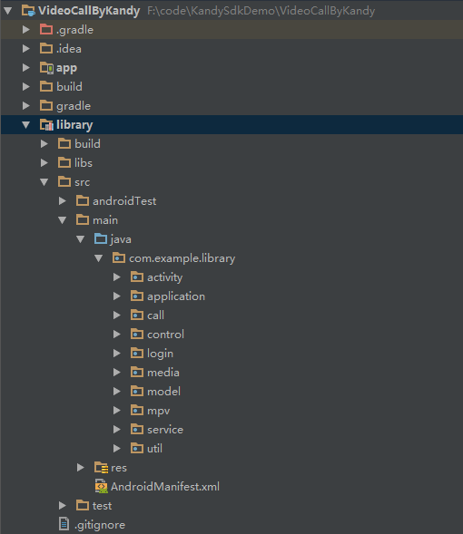

kandy sdk demo# SDK-UI-Android

SDKDemo 快速集成文档【Android】

集成步骤
添加代码

选择android studio下面的library工程库项目导入项目工程进行引用
如下所示：

在工程项目中继承library工程中的application下的BaseKandyApplication。

完成如上操作及集成好Android端的项目。
代码调用
Libraey工程包control下面的TxtKandy类是SDKDemo 实例化控制类，其中包括了：
	AccessKandy:账号登录；
	KandyCall: kandy的初始化以及点对点的通话；
	TxtMpvCallManmger:mpv视频会议控制类；
	ConnectCall:页面控制跳转类；
	DataMpvConnect:本地数据化存储类；
	MediaPlayControl：铃声控制类；
	

。
设置appid 和 appsecert 初始化kandySDK

	

在application中初始化参数分别为：key、secre、,hosturi；使用默认时参数置为null
TxtKandy.getKandyCall().initKandy(this,null,null,null);

用户登录
参考AccessKandy 
TxtKandy.getAccessKandy().userLogin(user,passward,callback)
User:登录用户名；
Passward:用户密码；
Callback:回调
拨打call
参考SupportViewController
TxtKandy.getKandyCall().showDoCallDialog(MainActivity.this,isVideo);

isVideo:布尔类型：是否是视频会话
发起MPV 会议
参考TxtMpvCallManmger

TxtKandy.getConnnectCall().skipDoCallMpv(MainActivity.this);

开启mpv视频会议会话，mpv相关功能模块请参考TxtMpvCallManmger

